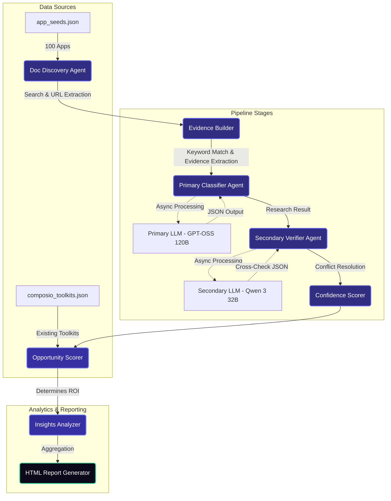
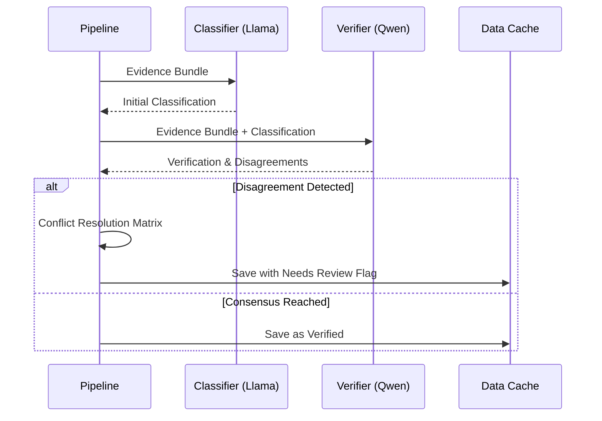

# Composio AI Product Ops Case Study

An automated, agentic research pipeline that evaluates 100 applications for Composio toolkit integration opportunities. The pipeline utilizes multi-model verification to autonomously extract authentication methods, API architecture, and MCP availability to surface the highest ROI integrations.

## 🚀 Architecture Deep Dive

The pipeline is structured as a robust multi-stage DAG (Directed Acyclic Graph). It processes applications concurrently, caches intermediate states, and utilizes strict rate-limiting for interacting with LLM providers (Groq) and Web Crawlers (Trafilatura).

### System Workflow



## 🧠 Core Agent Systems

### 1. The Classifier (Primary Agent)
Powered by `openai/gpt-oss-120b`, the Classifier Agent acts as the primary researcher. It is fed an `EvidenceBundle` containing deterministic keyword matches and cleaned documentation text excerpts. It extracts the Auth Method, Access Model, API Architecture, and MCP Availability.

### 2. The Verifier (Secondary Agent)
Powered by `qwen/qwen3-32b`, the Verifier Agent acts as the auditor. It receives the same `EvidenceBundle` *and* the Classifier's output. It evaluates the classification and acts as a discriminator, assigning a confidence score to each field and flagging disagreements.

### 3. Confidence & Resolution Matrix
If the Primary and Secondary agents agree, the confidence is set to high. If they disagree, a resolution matrix falls back to deterministic extraction or flags the application for Human-in-the-Loop (HITL) review.

### 4. Three-Step Grading System
Accuracy is explicitly measured and tracked across three distinct passes:
1. **First-Pass LLM (GPT-OSS 120B):** The initial classification accuracy.
2. **Second-Pass LLM (Qwen 3 32B):** Accuracy post-verification and confidence resolution.
3. **Final Audited Accuracy (Human):** The absolute ground-truth accuracy after manual human review.



## 📊 Opportunity Scoring Methodology

The ultimate goal of the pipeline is to surface the integrations with the lowest integration friction and highest ROI. The scoring is completely deterministic based on the LLM's classification.

**Maximum Score: 10.0**

- **Self-Serve Access**: `+3.0`
- **OAuth / API Key**: `+2.0`
- **REST API Available**: `+2.0`
- **Public OpenAPI Docs**: `+2.0`
- **MCP Server Available**: `+1.0`
- **Gated Enterprise Access**: `-3.0`
- **No API Available**: `-5.0`

## ⚙️ Concurrency & Rate Limiting

The pipeline employs an advanced concurrency strategy designed to maximize throughput while strictly adhering to Tier 1 free API limits (e.g., 30 Requests Per Minute on Groq).

- Implements `AsyncGroq` paired with `asyncio.Semaphore` logic.
- Dynamically intercepts `429 Too Many Requests` exceptions.
- Extracts `retry-after` HTTP headers from the API response to perform highly efficient localized sleep routines, avoiding global application blocks.

## 📂 Project Structure

```
├── data/                # Local cache directory for all pipeline stages
├── output/              # Final output directory (composio_research_report.html)
├── src/
│   ├── agents/          # Classifier, Verifier, and Doc Discovery Agents
│   ├── extraction/      # Regex-based signal extraction and evidence bundling
│   ├── insights/        # Opportunity scoring and data analytics
│   ├── report/          # HTML and Jinja2 rendering engines
│   └── verification/    # Confidence calculations
├── temp_scripts/        # Standalone utilities (e.g. Mock Audit script)
└── run.py               # Main CLI orchestrator
```

## 🚀 Execution

The pipeline is completely cross-platform. Ensure your virtual environment is activated and you have set your API keys (`GROQ_API_KEY`) in a `.env` file. (Note: Firecrawl is no longer required as the pipeline uses Trafilatura).

### Windows (PowerShell)

```powershell
# Run the full pipeline
python run.py --stage all

# Run with resume (uses cached data where available)
python run.py --stage all --resume

# Run a specific stage
python run.py --stage classify

# Generate Human-in-the-Loop audit worksheet (samples 30 apps)
python run.py --audit

# Recalculate true accuracy from audit worksheet and regenerate HTML report
python run.py --stage report
```

### Linux / macOS (Bash)

```bash
# Run the full pipeline
python3 run.py --stage all

# Run with resume (uses cached data where available)
python3 run.py --stage all --resume

# Run a specific stage
python3 run.py --stage classify

# Generate Human-in-the-Loop audit worksheet (samples 30 apps)
python run.py --audit

# Recalculate true accuracy from audit worksheet and regenerate HTML report
python run.py --stage report
```

## 🕵️‍♂️ Manual Verification (HITL)

To verify the agent's claims against ground truth:
1. Run `python run.py --audit` to automatically sample 30 apps into `data/audit_worksheet.json`.
2. Open `audit_worksheet.json` and manually grade the apps. For each app, enter the true values into the `human_*` fields and set the `*_correct` flags to `true` or `false` depending on whether the pipeline guessed correctly.
3. Run `python run.py --stage report`. The system will ingest your manual corrections, calculate the true **Final Audited Accuracy**, patch the final dataset, and automatically reflect the real ground-truth accuracy on the HTML dashboard!

## 🔁 Running URL Pattern Set (How It Grows)

The project keeps a persistent, additive URL pattern registry at `data/learned_url_patterns.json`.

- The file stores:
    - `patterns`: reusable templates like `developer.{domain}/docs`
    - `source_urls`: concrete human-provided URLs that produced those patterns
- During discovery (`src/agents/doc_discovery.py`), candidate URLs are built from:
    - built-in baseline patterns
    - learned patterns loaded from `learned_url_patterns.json` and applied to each app's base domain
- Growth happens when audit data is applied (`python run.py --stage report` with `data/audit_worksheet.json` present):
    - `src/verification/url_patterns.py:update_patterns_from_audit()` reads `human_urls`
    - new, unseen URLs are converted into normalized templates
    - patterns are merged via a set and written back (de-duplicated)

Important behavior:
- Pattern learning is append-only by design (no automatic deletion path).
- Discovery uses whatever has already been learned on every run.
- New patterns are added only when new `human_urls` are present in the audit worksheet.

## 🧰 URL Scraping and Parsing Stack

Current implementation for URL fetching and content parsing:

- HTTP crawling/fetching: `aiohttp`
- Main content extraction from HTML: `trafilatura`
- Lightweight HTML title parsing: `BeautifulSoup` (`bs4`) with `html.parser`

SQL parsing:

- No SQL parser is currently used in this codebase (no `sqlparse`, `sqlalchemy`, `sqlite3`, etc. in the pipeline code).
